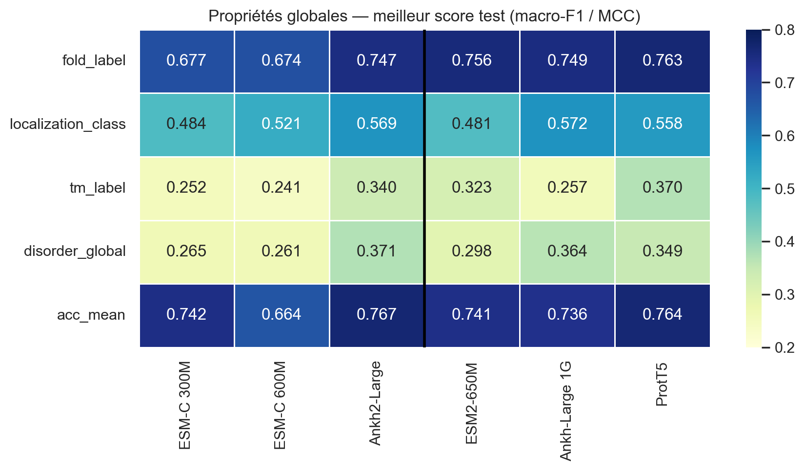
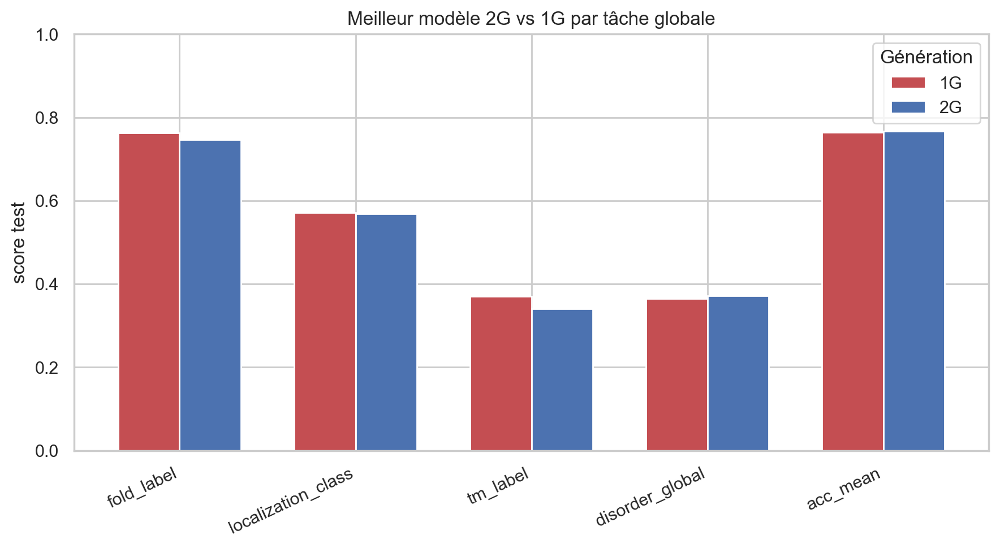
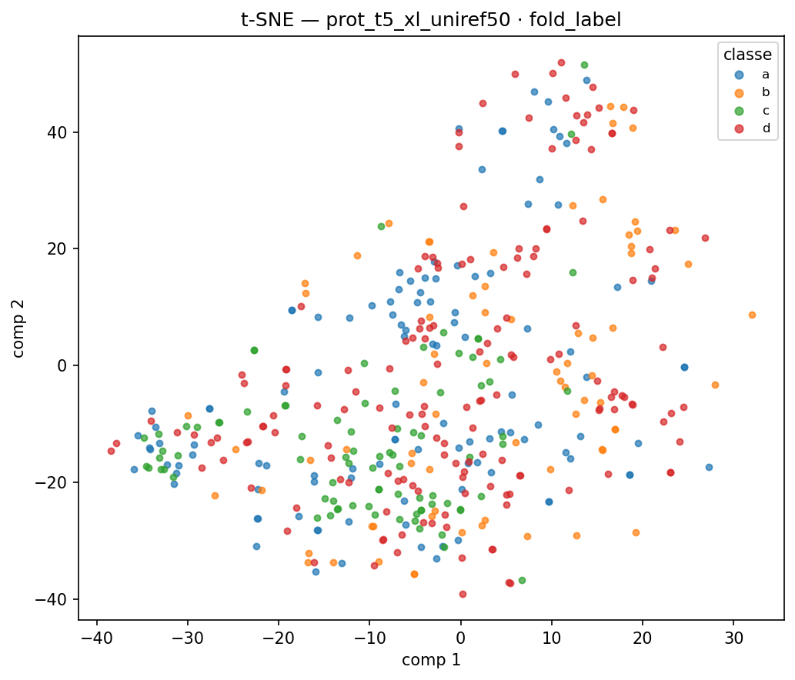

# Decoding Protein Embeddings — ESM-C & Ankh2

**M2 Bioinformatics · Université Paris Cité · INSERM UMR_S1134**

Do second-generation protein language models (ESM-C, Ankh2) better encode global protein properties than established baselines? We benchmark 6 PLMs on 6 global prediction tasks across 1,390 proteins from the ATLAS database.

---

## Key Finding

> **First-generation baselines significantly outperform second-generation models on global protein properties.** Mann-Whitney U tests confirm 1G models (ESM2, ProtT5, Ankh-Large) beat 2G models (ESM-C, Ankh2) on **fold** (p=0.002), **transmembrane** (p=0.024) and **disorder** (p=0.020). 2G models show **no significant advantage on any global task**.

Yet on **local per-residue tasks**, Ankh2-Large dominates — particularly secondary structure. This divergence suggests that 2G architectural improvements encode finer local structural information that is diluted during protein-level mean pooling.



---

## Results — Global Properties

Best classifier per task, test set. Metric: **macro-F1** for multi-class tasks (fold, localization, species), **MCC** for binary tasks (TM, disorder, accessibility).

| Task | ESM-C 300M | ESM-C 600M | Ankh2-Large | ESM2-650M | Ankh-L 1G | ProtT5 | 2G vs 1G |
|---|:-:|:-:|:-:|:-:|:-:|:-:|:-:|
| Fold classification (F1) | 0.677 | 0.674 | 0.747 | 0.756 | 0.749 | **0.763** | 1G ✓ (p=0.002) |
| Subcellular localization (F1) | 0.484 | 0.521 | 0.569 | 0.481 | 0.572 | 0.558 | ns |
| Species (F1) | 0.824 | 0.877 | 0.859 | 0.850 | 0.791 | **0.899** | ns |
| Transmembrane (MCC) | 0.252 | 0.241 | 0.340 | 0.323 | 0.257 | **0.370** | 1G ✓ (p=0.024) |
| Global disorder (MCC) | 0.265 | 0.261 | 0.371 | 0.298 | 0.364 | 0.349 | 1G ✓ (p=0.020) |
| Mean accessibility (MCC) | 0.742 | 0.664 | 0.767 | 0.741 | 0.736 | 0.764 | ns |

*ns = not significant (p > 0.05, Mann-Whitney U on 15-fold CV scores). 2G vs 1G compares the mean of the three 2G models against the mean of the three 1G baselines.*



## Results — Local Properties / Per-residue

Best classifier among LogReg / RF / MLP, test set (F1 / MCC).

| Task | ESM-C 300M | ESM-C 600M | Ankh2-Large | ESM2-650M | Ankh-L 1G | ProtT5 |
|---|:-:|:-:|:-:|:-:|:-:|:-:|
| RMSF / flexibility | 0.63 / 0.22 | 0.64 / 0.24 | **0.65 / 0.29** | 0.645 | 0.675 | 0.660 |
| Neq / disorder | 0.75 / 0.35 | 0.76 / 0.39 | **0.79 / 0.46** | 0.735 | 0.785 | 0.755 |
| B-factor | 0.69 / 0.17 | 0.68 / 0.17 | **0.70 / 0.17** | 0.700 | 0.710 | 0.705 |
| Solvent accessibility | 0.82 / 0.53 | 0.82 / 0.53 | **0.84 / 0.58** | 0.825 | 0.845 | 0.825 |
| Secondary structure (3) | 0.60 | 0.64 | **0.70** | 0.560 | 0.705 | 0.615 |
| Secondary structure (8) | 0.20 | 0.22 | **0.43** | 0.190 | 0.245 | 0.210 |

On per-residue tasks, **Ankh2-Large dominates across all 6 variables**, with the largest gain on secondary structure.

---

## Embeddings organize proteins into biological clusters

t-SNE of mean-pooled embeddings, colored by structural fold — proteins cluster by biological archetype without explicit supervision.



---

## Methods

**Dataset** — 1,390 non-redundant proteins from [ATLAS](https://www.dsimb.inserm.fr/ATLAS) (atomistic MD simulations). Train/test split: 973 / 417 proteins.

**Embeddings** — Generated via [PLM-API](https://gitlab.dsimb.inserm.fr/cretin/plm-api) on Apple M4 (MPS acceleration). All 6 models run on the full 1,390-protein set.

**Global pipeline** — Per-residue embeddings `[L × D]` aggregated by **mean pooling** → fixed-size protein representation `[D]`. Labels retrieved from ATLAS API (fold, organism) + UniProt REST API (transmembrane, localization). Classifiers: Logistic Regression, Random Forest, MLP with 15-fold stratified cross-validation. Statistical comparison: Mann-Whitney U test on per-fold scores.

**Local pipeline** — Per-residue embeddings matched to DSSP-derived labels (SS3, SS8, accessibility) and MD simulation labels (RMSF, Neq, B-factor). Same three classifiers, following the Soufir et al. (2024) framework.

**Interpretability** — SHAP values (top-20 dimensions per task) + drop curves (progressive dimension masking 0→100%).

---

## Models

| Model | Generation | Dim | Architecture |
|---|---|---|---|
| ESM-C 300M | 2G | 960 | Transformer encoder, UniRef + metagenomics |
| ESM-C 600M | 2G | 1152 | Transformer encoder, UniRef + metagenomics |
| Ankh2-Large | 2G | 1536 | T5 encoder + SiLU, ankh2-ext2 variant |
| ESM2-650M | 1G baseline | 1280 | BERT encoder, UniRef50 |
| Ankh-Large | 1G baseline | 1536 | T5 encoder + ReLU |
| ProtT5-XL | 1G baseline | 1024 | T5 encoder, UniRef50 |

---

## Repository Structure

```
├── analysis/
│   ├── global/
│   │   ├── build_global_dataset.py       # Mean pooling → per-protein CSV
│   │   ├── train_global_classifiers.py   # LogReg + RF + MLP, 15-fold CV
│   │   ├── stats_comparison.py           # Mann-Whitney U test 2G vs 1G
│   │   ├── plot_distributions.py         # Class distribution figures
│   │   ├── pca_tsne_global.py            # PCA / t-SNE of embedding spaces
│   │   └── shap_drop_global.py           # SHAP + drop curves
│   ├── local_train_full.py               # Per-residue, 3 classifiers
│   ├── full_prot_emb_2g.py               # Per-residue dataset builder
│   └── notebooks/
│       └── results_comparison.ipynb      # Full comparison notebook
├── scripts/
│   ├── fetch_global_labels.py            # ATLAS API + UniProt → global labels
│   ├── compute_dssp.py                   # DSSP v4 on ATLAS PDB files
│   ├── run_embeddings_m4.sh              # Embedding generation (M4 / MPS)
│   └── run_embeddings_1g.sh              # 1G baselines
├── results/
│   ├── global_results.csv                # All models × tasks × classifiers
│   ├── global_results_per_fold.csv       # Per-fold CV scores
│   ├── global_stats_comparison.csv       # Mann-Whitney U test results
│   ├── local_results_full.csv            # Per-residue, 3 classifiers
│   ├── dt_results_2g.csv / _1g.csv       # Per-residue, Decision Tree
│   ├── sota_comparison.md                # External SOTA context
│   ├── references.md                     # Bibliography
│   └── figures/                          # Heatmaps, SHAP, drop curves, PCA/t-SNE
├── pixi.toml                             # Reproducible environment (Python 3.11)
└── README.md
```

---

## Reproduce

### Requirements

- Python 3.11 + [pixi](https://pixi.sh)
- [PLM-API](https://gitlab.dsimb.inserm.fr/cretin/plm-api) for embedding generation
- Access to [ATLAS](https://www.dsimb.inserm.fr/ATLAS) database

### Setup

```bash
git clone https://github.com/assadiab/Decoding-protein-embeddings
cd Decoding-protein-embeddings
pixi install
```

### 1. Fetch data and labels

```bash
pixi run python scripts/download_atlas_data.py --workers 4
pixi run python scripts/fetch_global_labels.py        # fold, TM, localization, species
pixi run python scripts/compute_dssp.py --pdb_dir Datasets/ATLAS/data/ --output_dir Datasets/ATLAS/data/
```

### 2. Generate embeddings

```bash
source plm-api/.venv/bin/activate
bash scripts/run_embeddings_m4.sh   # 2G models (~8 min on M4)
bash scripts/run_embeddings_1g.sh   # 1G baselines
```

### 3. Run global analyses

```bash
pixi shell
python analysis/global/build_global_dataset.py       # mean pooling
python analysis/global/train_global_classifiers.py   # LogReg + RF + MLP
python analysis/global/stats_comparison.py           # Mann-Whitney U test
python analysis/global/shap_drop_global.py           # SHAP + drop curves
python analysis/global/pca_tsne_global.py            # PCA / t-SNE
```

### 4. Run per-residue analyses (extension)

```bash
python analysis/local_train_full.py
```

---

## References

- Vander Meersche Y. et al. (2023). **ATLAS: protein flexibility description from atomistic MD simulations.** *Nucleic Acids Research.* [doi:10.1093/nar/gkad1084](https://doi.org/10.1093/nar/gkad1084)
- Hayes T. et al. (2025). **Simulating 500 million years of evolution with a language model.** *Science*, 387(6736). (ESM-C)
- Elnaggar A. et al. (2023). **Ankh: Optimized Protein Language Model Unlocks General-Purpose Modelling.** *arXiv:2301.06568.*
- Lin Z. et al. (2023). **Evolutionary-scale prediction of atomic-level protein structure with a language model.** *Science*, 379, 1123–1130. (ESM2)
- Elnaggar A. et al. (2022). **ProtTrans: Toward Understanding the Language of Life Through Self-Supervised Learning.** *IEEE TPAMI*, 44(10).

---

**Assa Diabira** · M2 Bioinformatics, Université Paris Cité  
Supervisor: Pr. Jean-Christophe Gelly · Co-supervisor: Gabriel Cretin · INSERM UMR_S1134
